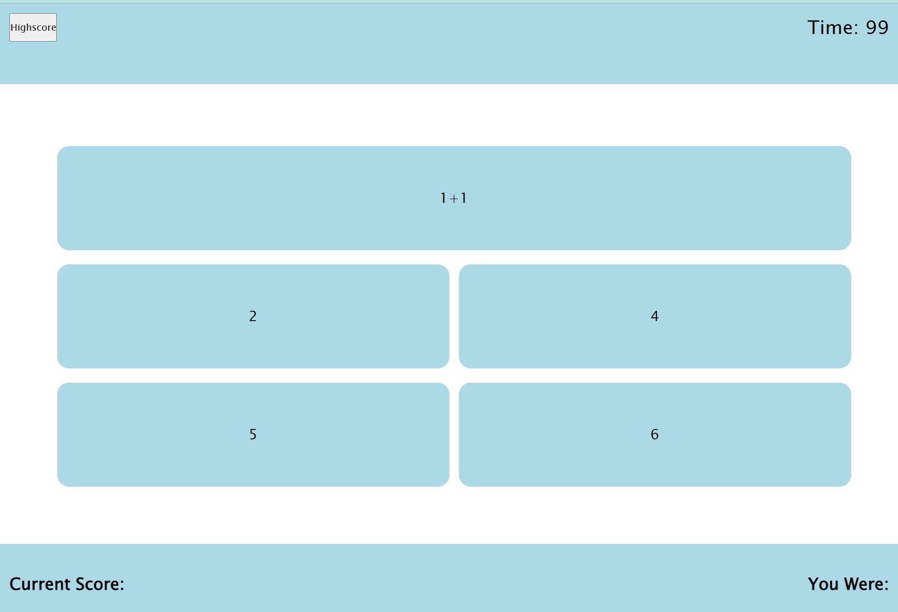

# My-Quiz

## USER STORY
AS A coding boot camp student
I WANT to take a timed quiz on JavaScript fundamentals that stores high scores
SO THAT I can gauge my progress compared to my peers

## ACCEPTANCE CRITERIA
GIVEN I am taking a code quiz
WHEN I click the start button
THEN a timer starts and I am presented with a question
WHEN I answer a question
THEN I am presented with another question
WHEN I answer a question incorrectly
THEN time is subtracted from the clock
WHEN all questions are answered or the timer reaches 0
THEN the game is over
WHEN the game is over
THEN I can save my initials and score

## Description
This is a quiz that have a series of 12 question. When quiz starts, the user will have a total of 100 seconds to finish. Each incorrect answer will subtract time by 10 second. At the end of the quiz, user can submit their name to the highscore board.

In this Challenge, we demonstrate our knowledge of event listener, nodes and data attributes.

## Usage

The use of this website is a game that test user knowledge.

## Features
High Score button on Top left will display highscore board
Start Button will start the quiz game
Reset button will start the quiz game
Submit button will submit user input name into highscore list.
Timer will start when quiz starts.

[website](https://github.com/nguyet33/My-Quiz)

